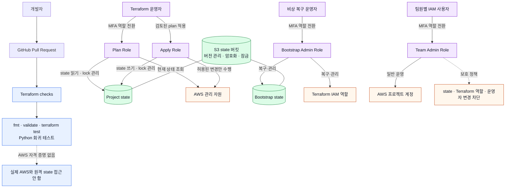
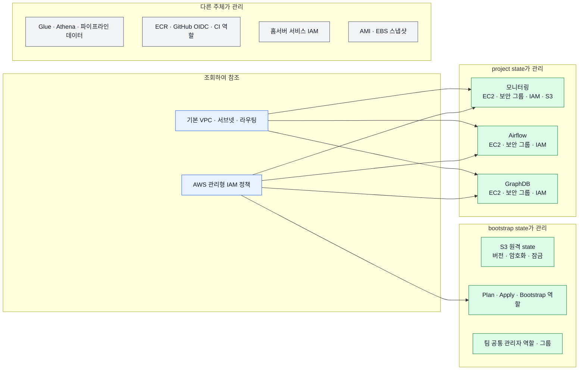

# Terraform 운영 아키텍처

## 변경·권한·state 흐름

### 흐름 해석

1. Pull request에서는 AWS 접속 없이 코드 형식·구성·테스트만 검증
2. 운영자가 MFA로 Plan Role을 맡아 실제 자원과 state의 차이 확인
3. 검토한 변경만 Apply Role로 적용하고 project state 갱신
4. state 버킷이나 Terraform IAM 복구가 필요할 때만 Bootstrap Admin Role 사용
5. 팀원은 개인 IAM 사용자에서 MFA로 Team Admin Role을 맡아 일반 AWS 작업 수행
6. Team Admin Role의 관리자 권한에도 state와 Terraform 운영 경로를 지키는 명시적 거부 정책 적용

## AWS 자원 관리 경계

### 관리 원칙

- `bootstrap state`: Terraform 자체 운영 기반과 접근 권한 관리
- `project state`: 장기 운영하는 핵심 서버와 서버 전용 종속 자원 관리
- `조회하여 참조`: 계정 기본·공유 자원을 재생성하지 않고 기존 식별자 사용
- `다른 주체가 관리`: 파이프라인·배포·서비스 계정 등 실제 생성 주체의 책임 유지

## 현재 한계와 다음 확장

- 팀 테스트용 보안 그룹 연결은 Terraform 영구 구성에 넣지 않은 운영 예외이며 project plan에 차이가 표시될 수 있음
- GitHub Actions는 현재 정적 검증만 수행하며 실제 AWS plan 권한을 보유하지 않음
- 다음 확장은 GitHub OIDC 전용 읽기 역할을 추가해 PR plan과 정기 drift 탐지를 자동화하는 작업
