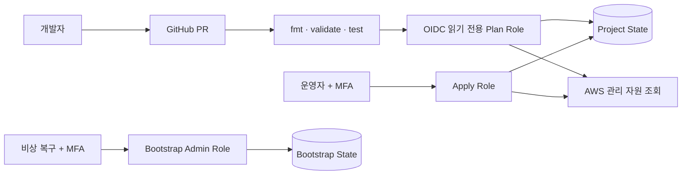

# Terraform 포트폴리오 고도화 로드맵

## 현재 확보한 강점

- 운영 중인 기존 AWS 자원을 재생성하지 않고 단계적으로 import
- 자원 묶음마다 생성·수정·삭제가 없는 plan을 확인한 뒤 적용
- S3 원격 state, 버전 관리, 암호화, 공개 접근 차단과 state 잠금 구성
- 동시 실행 잠금과 과거 state 복원 시험 완료
- EC2 삭제 방지와 위험한 교체 계획 차단
- 계획·적용·비상 복구 역할 분리와 MFA 기반 임시 권한 사용
- 저장 plan 검사기를 이용한 import·변경·삭제 대상 제한
- 실제 관리 자원과 조회·외부 관리·제외 자원의 소유 경계 문서화

현재 상태만으로도 단순한 Terraform 문법 사용을 넘어 **기존 운영 인프라를 안전하게 코드 관리로 전환한 경험**을 설명할 수 있음.

## 권장 우선순위

### 1. PR 정적 검증 자동화 — 최우선

AWS 자격 증명 없이 실행되는 GitHub Actions 구성.

**구현 범위**

- `terraform fmt -check -recursive`
- bootstrap과 project의 `terraform init -backend=false`
- 두 구성의 `terraform validate`
- `terraform test` 실행
- Python plan 검사기 회귀 테스트 56개 실행
- 워크플로에 최소 권한과 동시 실행 취소 설정 적용

**포트폴리오 근거**

- 잘못된 HCL과 회귀 오류가 main에 병합되기 전에 차단되는 과정 제시
- 로컬 검증 절차를 팀 공통 품질 게이트로 전환한 경험 설명
- 실패 PR과 수정 후 통과 PR을 실제 사례로 남길 수 있음

**완료 기준**

- Terraform 또는 검사기 변경 PR에서 자동 검증 실행
- 의도적으로 형식을 깨뜨리거나 테스트를 실패시킨 검증 브랜치에서 병합 차단 확인
- 정상 PR에서 모든 검사 통과 확인

### 2. 읽기 전용 plan과 drift 탐지 자동화 — 높은 가치

GitHub Actions가 AWS 장기 키 없이 OIDC로 전용 역할을 맡아 plan만 실행하는 구조.

**구현 범위**

- Terraform 저장소만 신뢰하는 GitHub OIDC plan 역할 생성
- project state 읽기·잠금과 관리 대상 자원 조회에 필요한 권한만 허용
- PR 또는 수동 실행에서 plan 파일과 요약 생성
- 정기 실행에서 코드와 실제 AWS의 차이를 탐지하고 실패 또는 알림 처리
- apply 권한은 워크플로에 제공하지 않음

**선행 조건**

- 비공개 backend 값과 tfvars를 GitHub Environment의 secret·variable로 전달하는 방식 결정
- 현재 팀 테스트용 네트워크 변경이 plan에 계속 표시되는 알려진 예외임을 반영
- project 전체가 항상 변경으로 표시되는 동안에는 bootstrap plan부터 자동화하거나, 운영 예외 종료 후 project drift 탐지를 활성화

**포트폴리오 근거**

- 장기 AWS 키 없이 임시 자격 증명을 사용하는 CI 인증 구조 제시
- 콘솔에서 발생한 변경을 자동으로 찾아내는 운영 통제 경험 설명
- 사람이 검토한 plan만 적용하는 현재 절차와 연결 가능

**완료 기준**

- OIDC 토큰의 저장소·브랜치 신뢰 조건 검증
- CI 역할에서 plan 성공과 apply 요청 거부 확인
- 의도적으로 만든 안전한 검증 차이를 탐지한 뒤 원상 복구 확인

### 3. 일반 변경용 plan 정책 검사 — 권장

현재 작업별 검사기를 공통 변경 검토 규칙으로 확장.

**구현 범위**

- 저장 plan JSON에서 생성·수정·삭제·교체 수 요약
- 기본적으로 삭제와 교체를 실패 처리
- 승인된 자원 주소와 동작만 명시적으로 허용
- 미확정 값 또는 계획 완료 실패를 성공으로 처리하지 않음
- 검사 결과를 CI 로그와 PR 요약에 표시

**포트폴리오 근거**

- `terraform plan` 성공 여부만 확인하지 않고 변경 내용을 정책으로 검증한 사례 제시
- import와 IAM 작업에서 사용한 전용 검사기를 지속 가능한 운영 규칙으로 발전

**완료 기준**

- 무관한 자원 변경·삭제·교체가 포함된 fixture에서 실패
- 검토된 변경만 포함한 fixture에서 통과
- PR plan 자동화와 연결

### 4. 채용 담당자용 사례 문서와 구조도 — 최우선

현재 README는 작업 기록이 상세하지만 핵심 성과를 빠르게 파악하기 어려움. 별도 사례 문서 또는 README 상단 요약 추가.

**포함할 내용**

- 배경: 수동으로 운영하던 여러 AWS 자원과 공유 계정의 변경 위험
- 목표: 기존 서버 중단이나 재생성 없이 Terraform 관리로 전환
- 설계: bootstrap/project state 분리, 단계적 import, 계획·적용·복구 역할 분리
- 핵심 트러블슈팅: EC2 교체 계획 차단, user data 자격 정보 제거, 동시 실행 잠금과 state 복원
- 결과: 세 서버와 종속 자원 편입, 공용 SSH 경로 정리, 상시 관리자 권한 제거, 관리 경계 확정
- 한계: 알려진 네트워크 운영 예외와 Terraform 외부 관리 자원

**권장 구조도**

**완료 기준**

- 처음 보는 사람이 3분 안에 문제·선택·안전장치·결과를 파악 가능
- 수치와 검증 결과는 저장소 기록으로 추적 가능
- 구현하지 않은 기능을 완료된 것처럼 표현하지 않음

## 선택 작업

### 정적 보안 검사

- Trivy configuration 또는 Checkov 중 하나만 선택
- 공개 SSH, 암호화 누락, 과도한 권한 등 현재 프로젝트와 관련된 규칙 우선 적용
- 이유가 있는 예외는 코드 주석보다 별도 예외 파일과 근거 문서로 관리

### 의존성 갱신 자동화

- Dependabot으로 Terraform provider와 GitHub Actions 버전 갱신 PR 생성
- lock 파일 변경과 validate 결과를 함께 검토
- 자동 병합 없이 사람이 릴리스 노트와 plan 영향 확인

### 실제 변경 사례 추가

- 향후 필요한 AWS 변경 하나를 Terraform PR → plan 검토 → 사용자 apply → 후속 plan 순서로 수행
- 새 자원을 포트폴리오 목적으로 억지로 만들지 않고 실제 운영 요구가 생겼을 때 진행
- 변경 전후 상태, 위험 요소, 롤백 방법과 검증 결과 기록

## 현재 불필요한 작업

- 반복 사용처가 없는 상태에서의 강제 모듈화
- 실제로 존재하지 않는 dev·stage·prod 환경 생성
- 팀 규모에 비해 운영 부담이 큰 Terraform Cloud 도입
- AWS를 변경하는 자동 apply
- 단위 테스트와 중복되는 대규모 Terratest 작성
- 관리 경계를 무시한 모든 AWS 자원의 일괄 import
- Terraform 포트폴리오만을 위한 Kubernetes 추가

이 작업들은 실제 반복성·환경 분리·조직 규모·배포 빈도가 생길 때 도입 근거가 생김.

## 권장 실행 순서

| 단계 | 작업 | 예상 범위 | 우선순위 |
|---|---|---:|---|
| 1 | 채용 담당자용 사례 문서와 구조도 | 문서 중심 | 필수 |
| 2 | 자격 증명 없는 PR 정적 검증 | 워크플로 1개 | 필수 |
| 3 | GitHub OIDC plan 역할과 수동 plan | IAM·워크플로 | 권장 |
| 4 | 정기 drift 탐지 | 워크플로 확장 | 권장 |
| 5 | 일반 변경용 plan 정책 검사 | 스크립트·테스트 | 권장 |
| 6 | 보안 검사·의존성 갱신 | 워크플로 확장 | 선택 |

1~2단계만 완료해도 현재 마이그레이션 경험을 검토 가능한 포트폴리오로 제시할 수 있음. 3~5단계까지 완료하면 Terraform을 도입한 경험에서 **팀 운영 자동화와 변경 통제 경험**으로 확장 가능.
